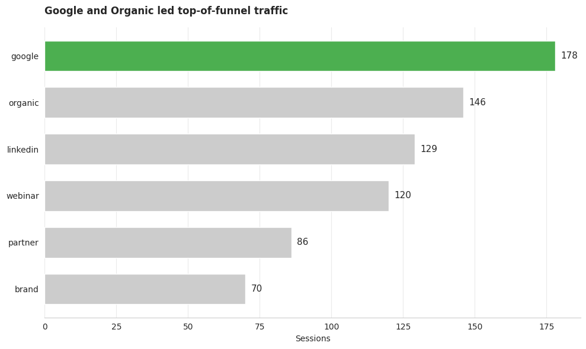
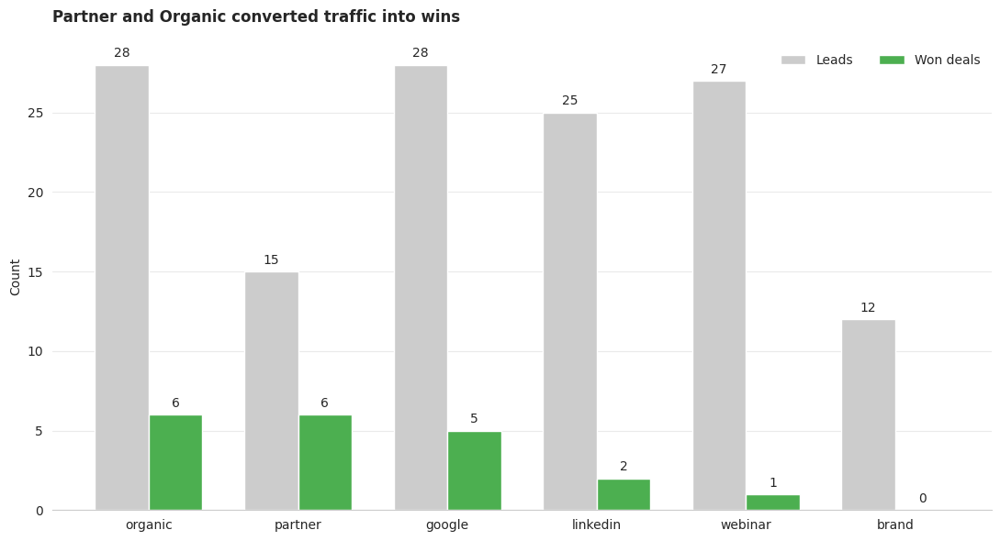
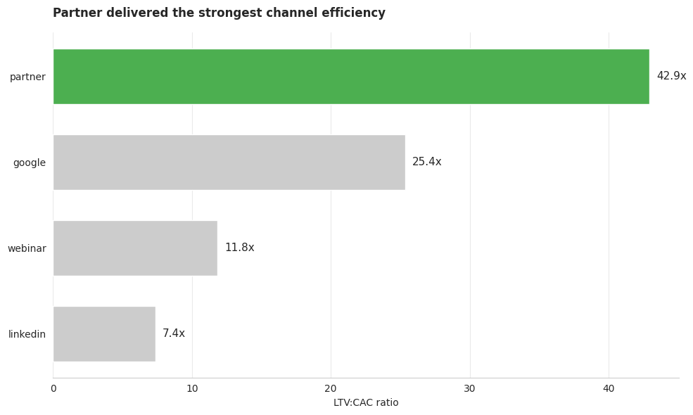

# B2B SaaS Marketing Attribution Analysis

## Overview
This project simulates a marketing analytics case study for a B2B SaaS company inspired by a Senior Marketing Analyst role at Remote. The analysis evaluates channel performance across the funnel, from sessions and first-touch leads to won revenue, CAC, LTV, and ROI.

## Business problem
Marketing teams often over-index on traffic and last-touch attribution when making budget decisions. This project shows why channel evaluation should combine volume, conversion quality, attribution context, and financial efficiency.

## Project goals
- Measure top-of-funnel traffic by source
- Compare first-touch lead generation across channels
- Evaluate funnel conversion from lead to opportunity to won deal
- Compare first-touch and last-touch attribution paths
- Estimate CAC, LTV, and ROI by channel
- Turn findings into budget recommendations

## Dataset
This project uses a realistic mock dataset created in Python and analyzed in SQL. It includes:
- `marketing_sessions.csv`
- `leads.csv`
- `opportunities.csv`
- `revenue.csv`
- `ad_spend.csv`

The data simulates a B2B SaaS buyer journey across Google, Organic, LinkedIn, Webinar, Partner, and Brand.

## Tools used
- Python
- pandas
- NumPy
- DuckDB / SQL
- Matplotlib
- Seaborn
- Google Colab
- Google Drive

## Project structure
```text
marketing_attribution_project/
├── data/
├── sql/
├── notebooks/
├── notes/
├── visuals/
│   ├── charts/
│   └── screenshots/
├── README.md
└── linkedin_post.md
```

## Analysis approach
1. Generate mock session, lead, opportunity, revenue, and spend data in Python
2. Save source files into Google Drive
3. Load CSVs into DuckDB
4. Run SQL for traffic, first-touch attribution, funnel conversion, and channel efficiency
5. Create charts in Python
6. Summarize business insights and recommendations

## Traffic analysis
Google and Organic led top-of-funnel traffic volume, making them the strongest raw acquisition channels by sessions and users. However, traffic alone does not explain which channels generated quality pipeline or efficient revenue outcomes.



## First-touch lead analysis
Organic and Google tied for the highest first-touch lead volume, while Webinar performed surprisingly well relative to its traffic level. This suggests that some channels can outperform on lead creation efficiency even if they do not rank first on raw traffic.

## Funnel quality
Organic and Partner generated the most won deals in the funnel analysis, and Partner had the strongest lead-to-opportunity conversion rate. This shows that channel quality can differ meaningfully from top-of-funnel volume.



## Attribution comparison
The attribution path analysis showed that Google captured the highest same-source first-touch to last-touch won revenue path, while Organic frequently appeared as a demand-creation channel whose journeys closed through other sources. Partner also stood out as a high-value source despite lower volume, which shows why first-touch and last-touch should be analyzed together rather than treated as interchangeable.

## Efficiency analysis
Partner was the most efficient acquisition channel based on LTV:CAC and ROI, while Google remained the strongest scalable paid channel. Webinar showed high average LTV but too few won customers to treat it as a proven scale channel, and Brand underperformed as a first-touch acquisition source in this sample.



## Key insights
- Google and Organic led on traffic volume.
- Organic and Google tied for first-touch lead generation.
- Organic and Partner led on won deals.
- Partner was the strongest channel for efficiency based on ROI and LTV:CAC.
- Google was the strongest scale channel.
- Webinar looked promising in customer value but lacked enough won volume for confident scaling.
- Brand was weak as a first-touch acquisition driver in this dataset.

## Recommendations
- Increase investment in Partner because it delivered the strongest efficiency and revenue quality.
- Keep Google as a core growth channel, but optimize for downstream conversion quality rather than traffic alone.
- Continue testing Webinar before scaling because its average LTV is attractive but current won-customer volume is too small.
- Avoid making budget decisions from traffic or last-touch attribution in isolation.
- Use multiple attribution views to separate demand creation from demand capture.

## How to run
1. Open the notebook in Google Colab
2. Mount Google Drive
3. Generate or load the CSV files
4. Load the CSVs into DuckDB
5. Run SQL queries in order
6. Create the charts
7. Review `notes/insights.md` for working notes and business takeaways

## Why this project matters
This case study is designed to show marketing analytics thinking beyond surface-level reporting. It demonstrates how SQL, Python, attribution analysis, funnel conversion, and financial metrics can be combined into practical channel recommendations suitable for a portfolio, interview discussion, and LinkedIn post.
